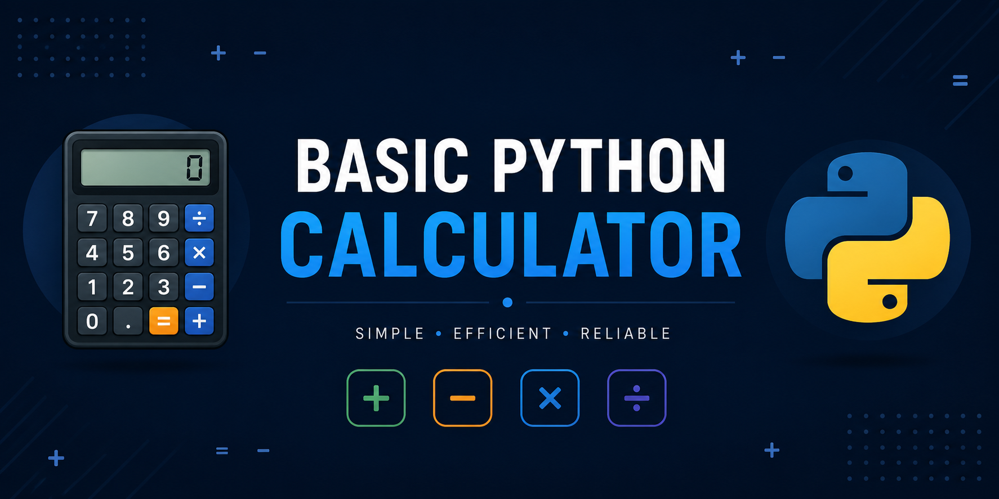

<p align="center">
  
</p>

# Basic Python Calculator

A simple calculator developed in Python as a collaborative academic project focused on applying programming fundamentals, version control practices, and teamwork using GitHub.

---

## Features

* Addition
* Subtraction
* Multiplication
* Division
* Division-by-zero handling
* Command-line interaction (CLI)

---

## Technologies Used

* Python 3
* Git
* GitHub

---

## Project Structure

```plaintext
basic-python-calculator/
│
├── assets/
│   └── banner.png
├── src/
│   └── main.py
├── requirements.txt
├── .gitignore
└── README.md
```

---

## Getting Started

### Clone the repository

```bash
git clone https://github.com/Ian-Arica/basic-python-calculator.git
```

### Navigate to the project directory

```bash
cd basic-python-calculator
```

### Run the application

```bash
python main.py
```

---

## Example Usage

```plaintext
Welcome to the Basic Python Calculator

1. Add
2. Subtract
3. Multiply
4. Divide

Enter operation: 1
Enter first number: 10
Enter second number: 5

Result: 15
```

---

## Development Practices

This project follows:

* Modular programming principles
* Conventional Commits
* Collaborative development with GitHub
* Clean and readable code structure

---

## Contributors

- [@Ian-Arica](https://github.com/Ian-Arica)
- [@rodrigosebastianramirezr-cloud](https://github.com/rodrigosebastianramirezr-cloud)
- [@Adriano2-02](https://github.com/Adriano2-02)
- [@moxixd5-sudo](https://github.com/moxixd5-sudo)

---

## License

This project is licensed under the MIT License.
